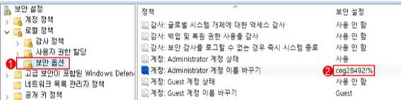

# W-01: Administrator 계정 이름 변경 등 보안성 강화

**분류**: Windows

**중요도**: 상

---

## 개요

### 점검 내용

윈도우 최상위 관리자 계정인 Administrator의 계정명 변경 또는 보안을 고려한 비밀번호 설정 여부 점검

### 점검 목적

윈도우 기본 관리자 계정인 Administrator의 이름을 변경 또는 보안을 고려한, 잘 알려진 계정을 통한 악의적인 패스워드 추측 공격을 차단하기 위함

### 보안 위협

-   일반적으로 관리자 계정으로 잘 알려진 Administrator를 변경하지 않는 경우 악의적인 사용자의 패스워드 추측 공격을 통해 사용 권한 상승의 위험이 있으며, 관리자를 유인하여 침입자의 액세스를 허용하는 악성코드를 실행할 위험이 존재함
-   윈도우 최상위 관리자 계정인 Administrator는 기본적으로 삭제하거나 잠글 수 없어 악의적인 사용자의 목표가 될 위험이 존재함

### 참고

!!! info "참고"
    윈도우 서버는 Administrator 계정을 비활성화할 수 있으나 안전 모드로 컴퓨터를 시작할 경우 본 계정은 자동으로 활성화됨

## 점검 대상 및 판단 기준

### 대상

Windows NT, 2000, 2003, 2008, 2012, 2016, 2019, 2022

### 판단 기준

**✅ 양호**: Administrator 기본 계정 이름을 변경하거나 강화된 비밀번호를 적용한 경우

**❌ 취약**: Administrator 기본 계정 이름을 변경하지 않거나 단순 비밀번호를 적용한 경우

## 조치 방법

Administrator 기본 계정 이름 변경 및 보안성이 있는 비밀번호 설정

### 조치 시 영향

일반적인 경우 영향 없음

## 점검 및 조치 사례

### Windows NT, 2000, 2003, 2008, 2012, 2016, 2019, 2022

1.  **시작 ＞ 제어판 > 관리 도구 > 관리 보안 정책 > 로컬 정책 > 보안 옵션**
2.  **"계정: Administrator 계정 이름 바꾸기"를 유추하기 어려운 계정 이름으로 변경**

