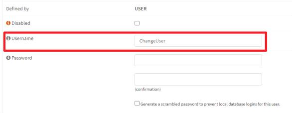

# S-01: 보안장비 Default 계정 변경

**분류**: 04_security

**중요도**: 상

---

보안 장비 > 1. 계정 관리

## 개요

### 점검 내용

보안 장비에 기본적으로 설정된 관리자 계정의 변경 여부 점검

### 점검 목적

보안 장비의 기본 관리자 계정정보는 인터넷이나 매뉴얼 등에 공개되어 있으므로 보안 장비의 기본 관리자 계정을 변경하여 비인가자가 기본 관리자 계정을 통한 보안 장비 접근을 방지하기 위함

### 보안 위협

보안 장비의 기본 관리자 계정을 변경하지 않을 경우, 비인가자가 공개된 기본 관리자 계정정보를 통하여 보안 장비에 불법적인 접근 및 보안 장비 설정값을 변경함으로써 시스템 침입 경로 제공 및 보안 장비를 무력화할 수 있는 위험이 존재함

### 참고

!!! info "기본 계정"
    장비 제조업체에서 출고 시 설정되어 나오는 기본 관리자 계정정보

## 점검 대상 및 판단 기준

### 대상

방화벽, VPN, IDS, IPS, Anti-DDoS, 웹 방화벽 등

### 판단 기준

**✅ 양호**: 장비에서 제공하고 있는 기본 계정을 변경하여 사용하는 경우

(기본 계정 변경이 불가능할 경우 기본 비밀번호 변경으로 보완 필요)

**❌ 취약**: 장비에서 제공하고 있는 기본 계정을 변경할 수 있으나 변경하지 않고 사용하는 경우

## 조치 방법

기본 계정 변경

### 조치 시 영향

일반적인 경우 영향 없음

## 점검 및 조치 사례

### 공통

1. Web을 통한 접속
1. 기본 계정, 비밀번호 입력
1. 접속 확인

1. 보안 장비에서 제공하고 있는 계정 메뉴에서 기본 계정 변경

1. 기본 계정 변경이 불가능할 경우 기본 비밀번호 변경으로 보완 필요