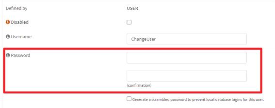

# S-02: 비밀번호 관리정책 설정

**분류**: 04_security

**중요도**: 상

---

보안 장비 > 1. 계정 관리

## 개요

### 점검 내용

보안 장비의 계정 비밀번호가 기관 정책에서 정의된 비밀번호 관리 정책 적용 여부 점검

### 점검 목적

비밀번호 관리 정책 적용 여부를 점검하여 비인가자의 비밀번호 추측 공격(무차별 대입 공격, 사전 대입 공격 등)에 대비가 되어있는지 확인하기 위함

### 보안 위협

비밀번호 관리 정책에 맞지 않는 비밀번호를 사용할 경우, 비인가자의 비밀번호 추측 공격(무차별 대입 공격, 사전 대입 공격 등)에 계정 비밀번호가 유출되어 비인가자가 보안 장비에 접근할 위험이 존재함

### 참고

!!! info "비밀번호 관리 정책"
    기관 정책에서 정의된 비밀번호 복잡성, 비밀번호 최소 길이, 비밀번호 최소 사용기간, 비밀번호 최대 사용기간

!!! info "무차별 대입 공격(Brute Force Attack)"
    컴퓨터로 암호를 해독하기 위해 가능한 모든 키를

하나하나 추론해 보는 시도

!!! info "사전 대입 공격(Dictionary Attack)"
    사전에 있는 단어를 입력하여 비밀번호를 알아내거나 암호를 해독하는 데 사용되는 컴퓨터 공격 방법

## 점검 대상 및 판단 기준

### 대상

방화벽, VPN, IDS, IPS, Anti-DDoS, 웹 방화벽 등

### 판단 기준

**✅ 양호**: 비밀번호 관리 정책에 맞는 비밀번호가 사용된 경우

**❌ 취약**: 비밀번호 관리 정책에 맞지 않는 비밀번호가 사용된 경우

## 조치 방법

해당 기관의 비밀번호 관리 정책에 따라 적합하게 설정

### 조치 시 영향

일반적인 경우 영향 없음

## 점검 및 조치 사례

### 공통

1. Web을 통한 접속
1. 기본 계정, 비밀번호 입력
1. 접속 확인

1. 비밀번호 메뉴에서 비밀번호 변경

1. 보안 장비가 제공하는 범위에서 비밀번호 관리 정책에 맞는 비밀번호로 변경

!!! info "복잡성 및 최소 길이"
    특수문자, 숫자, 영 소문자 포함 8자리 이상, 최소 사용기간(1일) 설정

