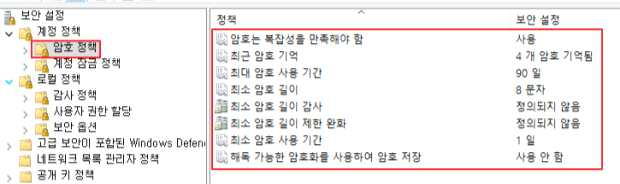

# PC-07: 파일 시스템이 NTFS 포맷으로 설정

**분류**: PC

**중요도**: 중

---

## 개요

### 점검 내용

하드 디스크의 파일 시스템이 NTFS를 사용 여부 점검

### 점검 목적

보안성 기능이 없는 FAT32를 지양하고 사용 권한 및 암호화를 통해 특정 파일에 대한 특정 사용자의 액세스를 제한할 수 있는 NTFS를 사용하여 보안성을 강화하기 위함

### 보안 위협

FAT32 파일 시스템을 사용하는 경우, 사용자의 컴퓨터에 액세스하는 사람은 누구나 컴퓨터 안에 있는 파일을 읽을 수 있으므로, 중요 파일에 접근할 수 없는 비인가자가 주요 정보를 유출할 수 있는 위험이 존재함

### 참고

!!! info "참고"
    *   기존에 FAT 파일 시스템을 사용하다가 NTFS로 변환하기 위해서는 `convert.exe` 명령을 사용할 수 있지만, FAT 파일 시스템으로 운영 중 변환해야 하는 경우 기본 ACL이 적용되지 않으므로 가능한 초기 설치 시 NTFS 파일 시스템을 선택하는 것을 권장함
    *   **ACL**: 프로세스가 시스템이나 파일에 읽기, 쓰기, 실행 등의 접근 여부를 허가하거나 거부하는 기능
    *   **NTFS, FAT32 파일 시스템 비교**: FAT32에는 NTFS가 제공하는 보안 기능이 없으므로 컴퓨터에 FAT32 파티션 또는, 볼륨이 있는 경우 컴퓨터에 액세스 가능한 모든 사용자가 파일을 읽을 수 있으며 FAT32에는 크기 제한이 있음
    *   최근 OS에서는 `convert.exe` 기능은 기본적으로 제공하나 FAT32 파일 시스템을 지원하지 않고 exFAT 파일 시스템을 지원함

## 점검 대상 및 판단 기준

### 대상

Windows 10, Windows 11

### 판단 기준

**✅ 양호**: 모든 디스크 볼륨의 파일 시스템이 NTFS인 경우

**❌ 취약**: 모든 디스크 볼륨의 파일 시스템이 FAT32인 경우

## 조치 방법

모든 디스크 볼륨에 대해 파일 시스템 NTFS로 변경

### 조치 시 영향

일반적인 경우 영향 없음

## 점검 및 조치 사례

### Windows 10, Windows 11

**Step 1) 디스크 볼륨의 파일 시스템이 “NTFS”인지 확인**

1.  시작 > 모든 앱 > Windows Tools > 컴퓨터 관리 > 저장소 > 디스크 관리 (시작 > 모든 앱 > Windows Tools > 실행 > “diskmgmt.msc” 입력 > 디스크 관리)

**Step 2) 모든 디스크 볼륨의 파일 시스템이 “NTFS”가 아닌 경우 취약점이 존재하므로, 모든 디스크 볼륨에 대해 파일 시스템을 “NTFS”로 변경**

**Step 3) NTFS 변경 후 폴더 및 파일에 적합한 ACL 적용**

1.  폴더나 파일을 마우스 오른쪽 버튼 클릭 후 단축메뉴에서 [속성] 선택
2.  [속성] 대화상자에서 [보안] 탭을 선택
3.  편집을 눌러 그룹이나 계정에 맞는 권한으로 변경

