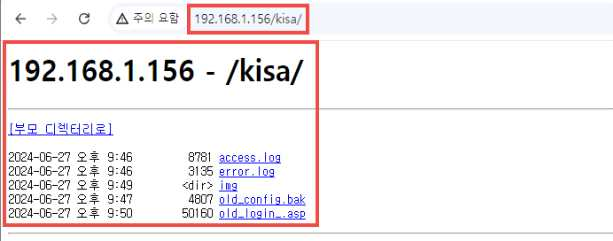
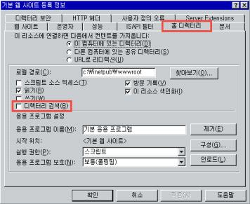

# DI: 3. 디렉터리 인덱싱

**분류**: Web Application(웹)

**중요도**: 상

---

## 개요

### 점검 내용

웹 애플리케이션 서버 내 디렉터리 인덱싱 취약점 존재 여부 점검

### 점검 목적

디렉터리 인덱싱 취약점을 제거하여 특정 디렉터리 내 불필요한 파일 정보의 노출 및 비인가자가 민감한 파일에 대한 접근을 차단

### 보안 위협

해당 취약점이 존재할 경우, 브라우저를 통해 특정 디렉터리 내 파일 리스트가 노출되어 응용 시스템의 구조가 외부에 공개될 수 있으며, 민감한 정보가 포함된 설정 파일 등이 노출될 경우 보안상 심각한 위험을 초래할 수 있음

### 참고

!!! info "디렉터리 인덱싱 취약점"
    특정 디렉터리의 초기 페이지(index.html, home.html, default.asp 등) 파일이 존재하지 않을 때 디렉터리 목록을 출력하는 취약점

## 점검 대상 및 판단 기준

### 대상

웹 애플리케이션 서버

### 판단 기준

**✅ 양호**: 디렉터리 파일 리스트가 노출되지 않는 경우

**❌ 취약**: 디렉터리 파일 리스트가 노출되는 경우

## 조치 방법

웹 애플리케이션 서버 설정을 변경하여 디렉터리 파일 리스트가 노출되지 않도록 설정

### 조치 시 영향

일반적인 경우 영향 없음

## 점검 및 조치 사례

### 점검 방법

1. URL 경로 중 확인하고자 하는 디렉터리 경로에 대하여 주소창에 입력하여 인덱싱 여부 확인


### 조치 방법

#### Apache

httpd.conf 파일 내 Indexes 옵션 제거 후 서버 재기동

**Apache 서버 설정 예시:**

```apache
<Directory /var/www/html>
    Options Indexes FollowSymLinks
    # Indexes 옵션 제거
    Options FollowSymLinks
</Directory>
```

#### Tomcat

web.xml 파일 내 아래 지시자 수정 후 서버 재기동

**Tomcat 서버 설정 예시:**

```xml
<init-param>
    <param-name>listings</param-name>
    <param-value>false</param-value>
</init-param>
```

#### IIS (6.0 이하)

인터넷 정보 서비스 → 등록 정보 → 홈 디렉터리 → 디렉터리 검색 해제



#### IIS (7.0 이상)

IIS 관리자 → 디렉터리 검색 → 사용 안 함


#### Nginx

`/etc/nginx/sites-available/default` 등 파일 내 아래 지시자 수정 후 서버 재기동

**Nginx 서버 설정 예시:**

```nginx
server {
    location / {
        autoindex off;
    }
}
```
