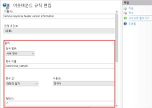
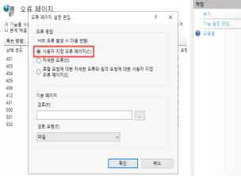

# EP: 4. 에러 페이지 적용 미흡

**분류**: Web Application(웹)

**중요도**: 상

---

## 개요

### 점검 내용

웹 애플리케이션 에러 페이지 내 불필요한 정보 노출 여부 점검

### 점검 목적

사용자 정의 에러 페이지를 설정하여 기본 서버 에러 페이지 내 불필요한 정보(서버 버전 정보, 시스템 절대 경로, 스택 트레이스 등)의 제공을 차단하기 위함

### 보안 위협

에러 페이지 내 서버 및 응용 시스템의 상세한 정보를 포함한 경우, 시스템 구조와 스택 트레이스, 데이터베이스 쿼리 등 민감한 정보를 노출시켜 공격 벡터로 악용할 가능성 존재

### 참고

!!! info "소스코드 및 취약점 점검 필요"

## 점검 대상 및 판단 기준

### 대상

웹 애플리케이션 서버, 웹 방화벽

### 판단 기준

**✅ 양호**: 에러 발생 시 자체 정의 에러 페이지를 출력하여 과도한 정보가 노출되지 않는 경우

**❌ 취약**: 에러 발생 시 기본 에러 페이지가 출력되며, 해당 페이지에 불필요한 정보(서버 버전 정보, 시스템 경로, 스택 트레이스 등)가 노출되는 경우

## 조치 방법

웹 애플리케이션 서버 내 사용자 정의 에러 페이지를 적용함으로써 불필요한 정보 노출을 방지

### 조치 시 영향

일반적인 경우 영향 없음

## 점검 및 조치 사례

### 점검 방법

1. 에러 유도 시 에러 페이지 내 불필요한 정보(서버 버전 정보, 시스템 절대 경로, 스택 트레이스 등)가 노출되는지 확인


### 조치 방법

#### Apache

apache2.conf 또는 httpd.conf 파일 내 아래 지시자 추가 후 서버 재기동

**응답 헤더 내 서버 버전 정보 제거 예시:**

```apache
ServerTokens Prod
ServerSignature Off
```

**사용자 에러 페이지 정의 예시:**

```apache
# 예) ErrorDocument 404 /main/error.html
ErrorDocument 404 [에러 페이지 경로]
ErrorDocument 405 [에러 페이지 경로]
# 추가적으로 에러 코드 등록하여 설정
```

#### Tomcat

server.xml 파일 내 아래 지시자 추가 후 서버 재기동

**응답 헤더 내 서버 버전 정보 제거 예시:**

```xml
<!-- server.xml 파일 내 <Connector> 요소에 아래 지시자 추가 후 서버 재기동 -->
<Connector port="8080" protocol="HTTP/1.1"
    connectionTimeout="20000"
    redirectPort="8443"
    maxParameterCount="1000"
    server=" "
/>
```

**개발용 리포트 비활성화 예시:**

```xml
<!-- server.xml 파일 내 아래 지시자 추가 후 서버 재기동 -->
<Valve className="org.apache.catalina.valves.ErrorReportValve"
    showReport="false" 
    showServerInfo="false" />
</Host>
```

**에러 페이지 매핑 예시:**

```xml
<!-- web.xml -->
<error-page>
    <error-code>404</error-code>
    <location>/errors/404</location>
</error-page>
<error-page>
    <error-code>500</error-code>
    <location>/errors/500</location>
</error-page>
<!-- 모든 예외(최상위) 공통 500 처리 -->
<error-page>
    <exception-type>java.lang.Exception</exception-type>
    <location>/errors/500</location>
</error-page>
```

#### Nginx

nginx.conf 파일 내 아래 지시자 추가 후 서버 재기동

**응답 헤더 내 서버 버전 정보 제거 예시:**

```nginx
http {
    server_tokens off;
    ...
}
```

/etc/nginx/sites-available/default 파일 내 아래 지시자 추가 후 서버 재기동

**사용자 에러 페이지 정의 예시:**

```nginx
server {
    listen 80;
    ...
    # 기타 설정
    
    error_page 400 401 402 405 /custom_4xx.html;
    error_page 404 /custom_404.html;
    error_page 500 502 503 504 /custom_5xx.html;
    
    location = /custom_404.html {
        root /var/www/html;
        internal;
    }
    location = /custom_4xx.html {
        root /var/www/html;
        internal;
    }
    location = /custom_5xx.html {
        root /var/www/html;
        internal;
    }
    ...
}
```

#### IIS (6.0 이하)

- 응답 헤더
    - Microsoft사의 URLScan 3.1 도구 지원 종료로 인한 서버 버전 제거 제한
- 에러 페이지
    - 인터넷 정보 서비스 → 등록 정보 → 사용자 정의 오류 → 등록 정보 편집 → 별도 에러 페이지 지정

        

#### IIS (7.0 이상)

- 응답 헤더
    1. URL Rewrite 모듈 설치 ([다운로드](https://www.iis.net/downloads/microsoft/url-rewrite))
    1. IIS 관리자 → URL 재작성 → 서버 변수 보기 → 추가 → RESPONSE_SERVER 변수 추가
    1. 규칙 추가 → 아웃바운드 규칙(빈 규칙) → 규칙 추가 → 적용

    

- 에러 페이지
    - IIS 관리자 → 오류 페이지 → 기능 설정 편집 → 사용자 지정 오류 페이지

    