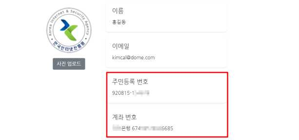
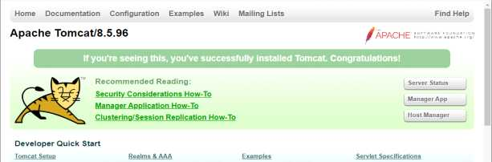

# IL: 5. 정보 누출

**분류**: Web Application(웹)

**중요도**: 상

---

## 개요

### 점검 내용

웹 애플리케이션 내 중요 정보(개인정보, 금융 정보 등) 및 불필요한 정보(주석 내 디버깅 정보, 초기 샘플페이지, 백업 파일 등)의 노출 여부 점검

### 점검 목적

웹 애플리케이션 내 중요 정보(개인정보, 금융 정보 등)에 대해 마스킹 처리를 하고, 서비스 제공 중 불필요한 정보(주석 내 디버깅 정보, 초기 샘플 페이지, 백업 파일 등)를 삭제하여 민감한 정보와 내부 시스템 정보의 노출을 차단하기 위함

### 보안 위협

웹 애플리케이션 운영 시 중요 정보(개인정보, 금융 정보 등)가 평문으로 노출될 경우, 개인정보 유출, 신원 도용, 피싱 공격 등의 위협이 발생할 수 있으며, 서버나 WAS의 초기 샘플 페이지, 백업 파일, 압축 파일 등이 노출될 경우, 공격자가 시스템 구조를 파악하고 보안 설정 및 접근 제어 정책을 유출하여 2차 공격에 활용할 수 있음

### 참고

!!! info "중요 정보"
    고유식별정보(주민등록번호), 비밀번호(로그인 비밀번호, 계좌 비밀번호, 공인인증서 비밀번호 등), 신용정보(보안카드번호, 카드번호 등) 등

!!! info "예외 처리"
    중요 정보 노출(일회성 노출)이 반드시 필요한 서비스의 경우 본인인증 절차 적용 시 예외 처리

!!! info "참고"
    소스코드 및 취약점 점검 필요

## 점검 대상 및 판단 기준

### 대상

웹 애플리케이션 소스코드, 웹 애플리케이션 서버

### 판단 기준

**✅ 양호**: 중요 정보가 마스킹 처리되어 있으며, 서비스 운영 및 서버 사이드의 구조를 파악할 수 있는 불필요한 정보가 노출되지 않는 경우

**❌ 취약**: 중요 정보가 평문으로 노출되거나, 서비스 운영 및 서버 사이드의 구조를 파악할 수 있는 과도한 정보가 노출되는 경우

## 조치 방법

중요 정보를 마스킹 처리하고, 샘플 페이지나 불필요한 정보를 제공하는 요소를 삭제하여 과도한 정보 노출을 최소화함으로써 민감 정보와 내부 시스템 구조의 노출을 방지함

### 조치 시 영향

일반적인 경우 영향 없음

## 점검 및 조치 사례

### 점검 방법

**Step 1)** 웹 애플리케이션 내 중요 정보(개인정보, 금융정보 등)의 평문 노출 여부 점검

**Step 2)** 서버나 WAS의 초기 샘플 페이지, 백업파일 등 불필요한 정보의 노출 유무 점검

**Step 3)** HTML 소스코드 내 중요 정보가 코드 및 주석을 통한 노출 여부 점검

### 조치 방법

1. robots.txt, web.config, nginx.conf 파일 작성을 통해 검색 차단할 디렉터리, 확장자, 페이지 등을 지정할 수 있으며 HTML 태그 내에 META 태그를 추가하여 검색엔진의 인덱싱을 차단함
2. 웹 디렉터리 내 삭제해야 할 파일 태그 확장자에 포함된 백업 파일을 모두 삭제하고, *.txt 확장자와 같이 작업 중 생성된 일반 텍스트 파일이나 이미지 파일 등 불필요한 파일에 대하여 제거
3. 웹 서버 설정 후 초기 페이지와 초기 디렉터리 및 배너를 삭제하여 Banner Grab에 의한 시스템 정보 유출을 차단함
4. 아래 개인정보 마스킹 기준 예시를 참고하여 개인정보 항목의 일부를 마스킹해야 함
5. 개발 중 작성된 주석 문자, 디버그 정보, 시스템 구조 관련 정보 등이 외부에 노출되지 않게 제거

#### 삭제 권고 파일 확장자 예시

| 확장자 | 설명 |
|--------|------|
| `*.bak` | 백업 파일 |
| `*.backup` | 백업 파일 |
| `*.org` | 원본 파일 |
| `*.old` | 이전 버전 파일 |
| `*.zip` | 압축 파일 |
| `*.log` | 로그 파일 |
| `*.sql` | SQL 파일 |
| `*.new` | 신규 파일 |
| `*.txt` | 텍스트 파일 |
| `*.tmp` | 임시 파일 |
| `*.temp` | 임시 파일 |
| `*.!` | 임시 파일 |

#### 개인정보 마스킹 기준 예시

참고 문서: 개인정보보호위원회 - 홈페이지 개인정보 노출방지 안내서

| 개인정보 | 설명 | 예시 |
|----------|------|------|
| 성명 | 성명 중 한 글자 이상 | 홍*동 |
| 주민등록번호 | 뒤에서부터 6자리 | 901231-1****** |
| 여권번호 | 뒤에서부터 4자리 | 12345**** |
| 연락처 | 전화번호 또는 휴대폰 뒤 4자리 | 010-1234-**** |
| 카드번호 | 7번째에서 12번째자리 | 9430-82**-****-2393 |
| 계좌번호 | 뒤에서부터 5자리 | 430-20-1***** |
