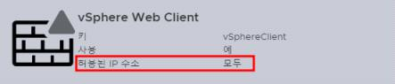
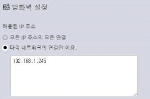

# HV-02: 가상화 장비 외부접속 차단

**분류**: 11_virtualization

**중요도**: 상

---

11. 가상화 장비

가상화 장비 > 1. 계정 관리

## 개요

### 점검 내용

허용할 호스트에 대한 접속 IP 제한 설정 여부 점검

### 점검 목적

허용한 호스트만 서비스를 사용하게 하여 비인가자의 무단 접근 시도를 예방하기 위함

### 보안 위협

호스트에서 실행되는 서비스에 대한 접근을 제한하지 않으면 비인가자의 무단 접근에 노출되어 가상화 시스템 침해사고의 위험이 존재함

### 참고

!!! info "TCP Wrapper"
    호스트 기반의 네트워킹 ACL(Access Control List) 시스템

!!! info "IPTables"
    리눅스 커널 방화벽이 제공하는 테이블들과 그것을 저장하는 체인, 규칙들을 구성할 수 있게 해주는 서비스

!!! info "FirewallD"
    Linux 운영체제를 위한 방화벽 관리 도구

## 점검 대상 및 판단 기준

### 대상

VMware ESXi, vCenter, XenServer, KVM, Nutanix

### 판단 기준

**✅ 양호**: 허용된 IP에서만 관리 콘솔 및 원격 접속이 가능하도록 제한된 경우

**❌ 취약**: 허용된 IP에서만 관리 콘솔 및 원격 접속이 가능하도록 제한되지 않은 경우

## 조치 방법

호스트에서 제공하는 방화벽 애플리케이션을 이용하여 서비스 접속 허용 IP 등록 설정

### 조치 시 영향

IPTables의 기본 정책을 Drop으로 변경하는 경우에는 애플리케이션 간의 연결 현황을 확인 후 변경이 필요함

## 점검 및 조치 사례

### VMware ESXi, vCenter

#### 웹 콘솔 접속 IP 제한 설정

1. Web 콘솔 페이지 접속
    - https://VMware-ESXi-IP
. 네트워킹 > 방화벽 규칙으로 이동
1. [ESXi] SSH 서버 “허용된 IP주소” 확인
1. [vSphere] 웹 클라이언트 “허용된 IP주소” 확인
    
1. IP 제한 설정이 적용되어 있지 않은 경우 vSphere Web Client(SSH 서버) > 설정 편집 > 다음 네트워크의 연결만 허용 선택
1. 접속 허용 IP 입력

    

### XenServer, KVM

#### IPTables를 통한 접근 통제

1. 호스트 접속
```bash
$ iptables -nL --line-number
Chain INPUT (policy ACCEPT)
num target prot opt source destination
1 xapi_nbd_input_chain tcp -- 0.0.0.0/0 0.0.0.0/0 tcp dpt:10809
2 ACCEPT 47 -- 0.0.0.0/0 0.0.0.0/0
3 RH-Firewall-1-INPUT all -- 0.0.0.0/0 0.0.0.0/0
… 중간 생략 …
Chain RH-Firewall-1-INPUT (2 references)
num target prot opt source destination
1 ACCEPT all -- 0.0.0.0/0 0.0.0.0/0
2 ACCEPT icmp -- 0.0.0.0/0 0.0.0.0/0 icmptype 255
3 ACCEPT udp -- 0.0.0.0/0 0.0.0.0/0 udp dpt:67
4 ACCEPT all -- 0.0.0.0/0 0.0.0.0/0 ctstate RELATED,ESTABLISHED
5 ACCEPT udp -- 0.0.0.0/0 0.0.0.0/0 ctstate NEW udp dpt:694
6 ACCEPT tcp -- 0.0.0.0/0 0.0.0.0/0 ctstate NEW tcp dpt:22
7 ACCEPT tcp -- 0.0.0.0/0 0.0.0.0/0 ctstate NEW tcp dpt:80
8 ACCEPT tcp -- 0.0.0.0/0 0.0.0.0/0 ctstate NEW tcp dpt:443
9 ACCEPT tcp -- 0.0.0.0/0 0.0.0.0/0 tcp dpt:21064
10 ACCEPT udp -- 0.0.0.0/0 0.0.0.0/0 multiport dports 5404,5405
11 REJECT all -- 0.0.0.0/0 0.0.0.0/0 reject-with icmp-host-prohibited
```

1. IPTables 정책 목록을 통해 접속 IP 제한 설정 확인
1. SSH 원격 접속을 허용된 IP로만 제한
    ```bash
    $ iptables -I RH-Firewall-1-INPUT 1 -p tcp -s <허용 IP> --dport 22 -j ACCEPT 
    $ iptables -I RH-Firewall-1-INPUT 2 -p tcp -s 0.0.0.0/0 --dport 22 -j DROP
    ```
1. IPTables의 변경된 정책 저장 및 서비스 재시작
    ```
    $ service iptables save $ service iptables restart
    ```

### Nutanix

1. Controller VM에 접속하여 설정 확인
    ```
    sudo cat /etc/hosts.allow | grep –v "^#“
    ```
1. vi 편집기를 이용하여 hosts.allow 파일에 ssh 접속이 필요한 IP만 접속을 허용 하도록 설정

    ```bash
    sudo vi /srv/salt/security/CVM/network/hosts.allow
    ```

    ```
    sshd: 192.168.100.1 : ALLOW
    ```

1. 변경 설정 적용
```bash
sudo salt-call state.sls security/CVM/networkCVM 
```